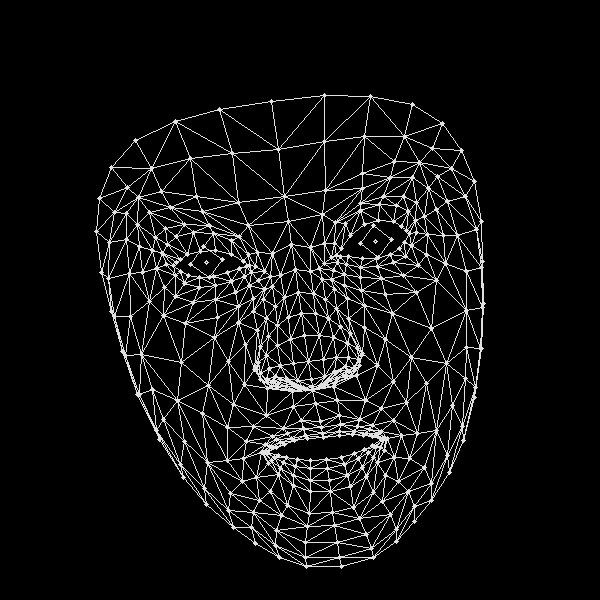

# FER-MediaPipe
[link para a previsão em tempo real](https://fer-01.vercel.app/) 
Este repositório contém um projeto de Reconhecimento de Emoções Faciais (FER) usando MediaPipe para a detecção de pontos faciais e modelos personalizados para a classificação de emoções.
## Tabela de Conteúdos

- [Visão Geral do Projeto](#visão-geral-do-projeto)
- [Funcionalidades](#funcionalidades)
- [Instalação](#instalação)
- [Contribuições](#contribuições)

## Visão Geral do Projeto

O projeto **FER-MediaPipe** tem como objetivo classificar emoções faciais com base em pontos detectados através do MediaPipe. Este modelo detecta pontos faciais chave e os envia para um classificador treinado para prever um dos vários estados emocionais.
O objetivo principal deste projeto foi comparar o desempenho de diferentes landmarsk com o [mediapipe](https://ai.google.dev/edge/mediapipe/solutions/guide?hl=pt-br)
Para isso usamos 2 datasets o  [affectnet](https://www.kaggle.com/datasets/noamsegal/affectnet-training-data) e o [FER-2013](https://www.kaggle.com/datasets/msambare/fer2013)

Comparação de Tipos de Landmarks e a imagem original
Imagem original


O MediaPipe oferece diferentes tipos de landmarks, como pontos básicos, pontos detalhados e mesh completo. Aqui está uma breve comparação:


Landmarks Básicos: Conjunto mínimo de pontos que inclui olhos, boca e contorno do rosto.


Landmarks Detalhados: Conjunto ampliado que inclui sobrancelhas, nariz e boca de forma mais precisa.


Landmarks Mesh: O mesh completo oferece uma representação densa da face, com pontos espalhados por toda a superfície.


As emoções detectadas incluem:
- Raiva
- Desprezo
- Nojo
- Medo
- Felicidade
- Neutro
- Tristeza
- Surpresa

## Funcionalidades

- Extração de pontos faciais usando [MediaPipe](https://google.github.io/mediapipe/).
- Classificação de emoções usando um modelo de deep learning personalizado.
- Integração com datasets populares como FER2013 e AffectNet.
- Detecção de emoções faciais em tempo real via webcam ou imagens estáticas .

## Instalação

1. Clone o repositório:
    ```bash
    git clone https://github.com/danielcasanova12/FER-MediaPipe.git
    cd FER-MediaPipe
    ```

2. Instale as dependências necessárias:
    ```bash
    pip install -r requirements.txt
    ```

3. Instale as dependências adicionais para o MediaPipe e machine learning:
    ```bash
    pip install mediapipe opencv-python tensorflow
    ```

4. Se encontrar problemas com o `dlib`, certifique-se de que o `CMake` está instalado e configurado no PATH do sistema.

## Uso

### Execução da Detecção de Emoções com Webcam


Para executar a detecção de emoções em tempo real usando sua webcam, use o seguinte comando:

```bash
python webcam_emotion_detector.py


# FER-MediaPipe: Reconhecimento de Emoções Faciais com MediaPipe e ResNet-50

Este projeto tem como objetivo o reconhecimento de emoções faciais utilizando os datasets **FER-2013** e **AffectNet**, combinando a detecção de landmarks faciais via **MediaPipe** com modelos de deep learning baseados em **ResNet-50**. O sistema classifica emoções como **felicidade, tristeza, raiva, medo, surpresa, neutro**, e outras, conforme as necessidades dos datasets.

## Índice
- [Visão Geral](#visão-geral)
- [Pré-processamento](#pré-processamento)
  - [FER-2013](#fer-2013)
  - [AffectNet](#affectnet)
- [Modelos Utilizados](#modelos-utilizados)
  - [Modelo 1: ResNetV1](#modelo-1-resnetv1)
  - [Modelo 2: CustomResNet50](#modelo-2-customresnet50)
- [Treinamento](#treinamento)
- [Métricas e Avaliação](#métricas-e-avaliação)
- [Como Executar](#como-executar)
- [Estrutura do Projeto](#estrutura-do-projeto)

## Visão Geral

Este projeto utiliza duas abordagens principais para o reconhecimento de emoções faciais:

1. **Imagens Completas**: Utilizamos a **ResNet-50** para classificar as emoções diretamente nas imagens faciais completas.
2. **Landmarks com MediaPipe**: MediaPipe é utilizado para extrair landmarks faciais e posteriormente classificar emoções utilizando um modelo de aprendizado profundo.

O objetivo é comparar essas abordagens e entender qual delas é mais eficaz em termos de acurácia e performance computacional.

## Pré-processamento

### FER-2013
O dataset **FER-2013** foi pré-processado para remover a classe **"Nojo"**, simplificando a tarefa de classificação. As classes restantes são:

- Raiva
- Medo
- Felicidade
- Tristeza
- Surpresa
- Neutro

#### Transformações:
- **Treino**:
  - Rotação Aleatória (15 graus)
  - Redimensionamento para 224x224
  - Normalização
- **Validação**:
  - Redimensionamento para 224x224
  - Normalização

### AffectNet
O dataset **AffectNet** foi utilizado **sem modificações**. Contém 8 classes de emoções, incluindo a classe "Desprezo".

#### Transformações:
- **Treino**:
  - Rotação Aleatória (15 graus)
  - Redimensionamento e Crop aleatório para 224x224
  - Normalização
- **Validação**:
  - Redimensionamento para 224x224
  - Normalização

## Modelos Utilizados

### Modelo 1: ResNetV1
O **Modelo 1** é uma versão personalizada da ResNet-50, com algumas camadas descongeladas para ajuste fino.

#### Características:
- **Modelo Base**: ResNet-50 pré-treinada no ImageNet.
- **Congelamento de Camadas**: Todas as camadas, exceto as últimas 4, foram congeladas para preservar os pesos aprendidos.
- **Modificação da Camada Final**:
  - `Linear(num_features, 512)`
  - `ReLU(inplace=True)`
  - `Dropout(0.3)`
  - `Linear(512, num_classes)`
  - `LogSoftmax(dim=1)`

### Modelo 2: CustomResNet50
O **Modelo 2** também utiliza a arquitetura ResNet-50, mas com todas as camadas treináveis.

#### Características:
- **Modelo Base**: ResNet-50 pré-treinada no ImageNet.
- **Todas as Camadas Treináveis**: Nenhuma camada foi congelada.
- **Modificação da Camada Final**:
  - `Linear(num_features, 512)`
  - `ReLU()`
  - `Dropout(0.5)`
  - `Linear(512, num_classes)`

## Treinamento

O processo de treinamento foi implementado através da classe **Trainer**, que gerencia todo o ciclo de treino, validação e salvamento dos melhores modelos.

### Parâmetros de Treinamento:
- **Otimizador**: Adam (`lr=0.0001`, `weight_decay=1e-4`)
- **Função de Perda**: Cross Entropy Loss
- **Scheduler**: Opcional, utilizado para reduzir a taxa de aprendizado automaticamente se a performance não melhorar.
- **Early Stopping**: O treinamento para automaticamente após 5 épocas sem melhoria na acurácia de validação.

### Processo de Treinamento:
1. **Treino e Validação**: A cada época, o modelo é treinado e validado. Se a acurácia de validação melhorar, o modelo é salvo.
2. **Métricas de Avaliação**:
   - Acurácia
   - Precisão
   - Recall
   - F1-Score
3. **Early Stopping**: O treinamento para após 5 épocas consecutivas sem melhoria na validação.

## Métricas e Avaliação

Durante o treinamento, as seguintes métricas foram calculadas:
- **Acurácia**: Percentual de acertos.
- **Precisão**: Quantidade de verdadeiros positivos sobre os positivos preditos.
- **Recall**: Quantidade de verdadeiros positivos sobre os verdadeiros positivos totais.
- **F1-Score**: Média harmônica entre precisão e recall.
- **Matriz de Confusão**: Para verificar os erros de classificação entre as classes.

Essas métricas foram utilizadas para avaliar o desempenho dos modelos durante o treinamento e validação.

## Como Executar

### Requisitos

1. **Instalação de Dependências**:
   Certifique-se de ter instalado as bibliotecas necessárias. Execute:
   ```bash
   pip install -r requirements.txt

### Estrutura de Diretórios

Organize os dados de treino e validação nas pastas corretas, conforme o exemplo abaixo:

```bash
├── data
│   ├── affectnet
│   │   ├── treino
│   │   └── validacao
│   └── fer2013
│       ├── treino
│       └── validacao


### Execução do Treinamento

Para treinar o modelo, utilize o script principal, ajustando o caminho dos datasets:

```bash
python train.py --dataset_path 'caminho_para_o_dataset' --model 'modelo_1'


```bash
├── data                     # Pasta com os datasets
├── models                   # Modelos treinados
├── src                      # Código fonte
│   ├── model_1.py           # Definição do Modelo 1
│   ├── model_2.py           # Definição do Modelo 2
│   ├── train.py             # Script de treinamento
│   └── transforms.py        # Transformações dos dados
├── requirements.txt         # Dependências do projeto
├── README.md                # Este arquivo


