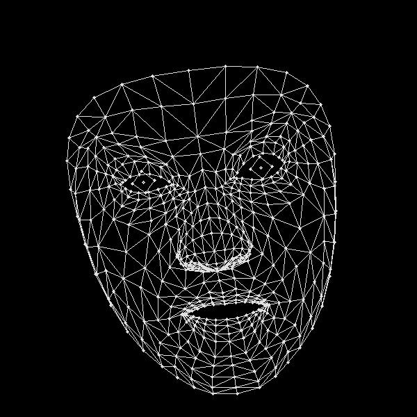

# FER-MediaPipe
[link para a previsão em tempo real](https://fer-01.vercel.app/) 
Este repositório contém um projeto de Reconhecimento de Emoções Faciais (FER) usando MediaPipe para a detecção de pontos faciais e modelos personalizados para a classificação de emoções.
## Tabela de Conteúdos

- [Visão Geral do Projeto](#visão-geral-do-projeto)
- [Funcionalidades](#funcionalidades)
- [Instalação](#instalação)
- [Contribuições](#contribuições)

## Visão Geral do Projeto

O projeto **FER-MediaPipe** tem como objetivo classificar emoções faciais com base em pontos detectados através do MediaPipe. Este modelo detecta pontos faciais chave e os envia para um classificador treinado para prever um dos vários estados emocionais.
O objetivo principal deste projeto foi comparar o desempenho de diferentes landmarsk com o [mediapipe](https://ai.google.dev/edge/mediapipe/solutions/guide?hl=pt-br)
Para isso usamos 2 datasets o  [affectnet](https://www.kaggle.com/datasets/noamsegal/affectnet-training-data) e o [FER-2013](https://www.kaggle.com/datasets/msambare/fer2013)

Comparação de Tipos de Landmarks e a imagem original
Imagem original

O MediaPipe oferece diferentes tipos de landmarks, como pontos básicos, pontos detalhados e mesh completo. Aqui está uma breve comparação:


Landmarks Básicos: Conjunto mínimo de pontos que inclui olhos, boca e contorno do rosto.


Landmarks Detalhados: Conjunto ampliado que inclui sobrancelhas, nariz e boca de forma mais precisa.


Landmarks Mesh: O mesh completo oferece uma representação densa da face, com pontos espalhados por toda a superfície.


As emoções detectadas incluem:
- Raiva
- Desprezo
- Nojo
- Medo
- Felicidade
- Neutro
- Tristeza
- Surpresa

## Funcionalidades

- Extração de pontos faciais usando [MediaPipe](https://google.github.io/mediapipe/).
- Classificação de emoções usando um modelo de deep learning personalizado.
- Integração com datasets populares como FER2013 e AffectNet.
- Detecção de emoções faciais em tempo real via webcam ou imagens estáticas .

## Instalação

1. Clone o repositório:
    ```bash
    git clone https://github.com/danielcasanova12/FER-MediaPipe.git
    cd FER-MediaPipe
    ```

2. Instale as dependências necessárias:
    ```bash
    pip install -r requirements.txt
    ```

3. Instale as dependências adicionais para o MediaPipe e machine learning:
    ```bash
    pip install mediapipe opencv-python tensorflow
    ```

4. Se encontrar problemas com o `dlib`, certifique-se de que o `CMake` está instalado e configurado no PATH do sistema.

## Uso

### Execução da Detecção de Emoções com Webcam


Para executar a detecção de emoções em tempo real usando sua webcam, use o seguinte comando:

```bash
python webcam_emotion_detector.py


